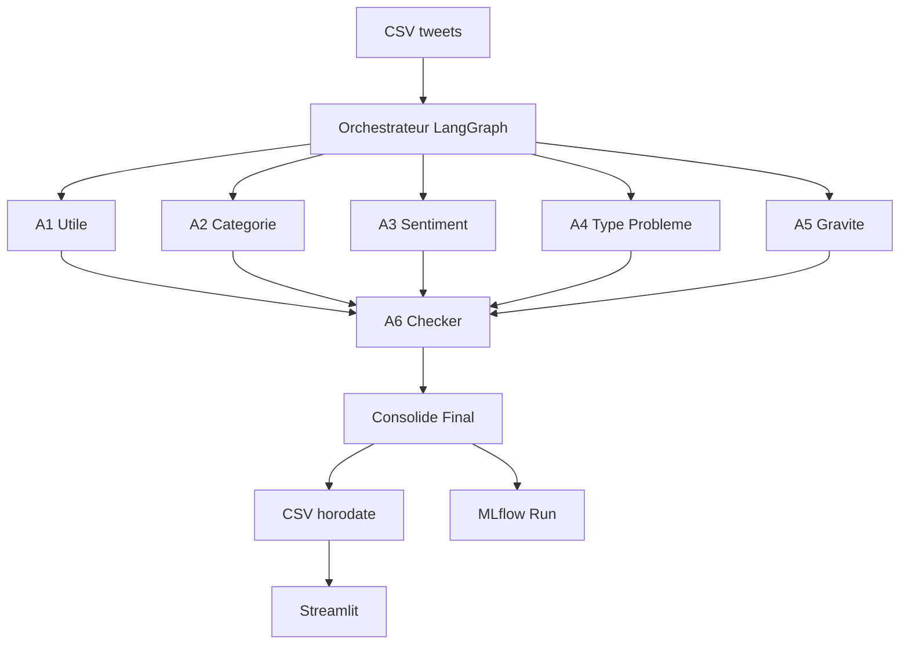

# FreeMind SAV Pipeline

Pipeline multi-agents (LangGraph + Ollama) pour analyser des tweets Free, suivre les executions dans MLflow et visualiser les resultats dans Streamlit.

## Vue d'ensemble

- **Objectif**: capter les emotions, le type de probleme et la gravite des messages lies aux offres Free.
- **Entree**: CSV `data/free_tweet_export_clean.csv` (ou autre export).
- **Sorties**:
  - CSV horodates dans `data/results/` (log + metadonnees JSON).
  - Traces/parametres/artefacts MLflow (`mlruns/`).
  - Tableau interactif via `apps/streamlit_app.py`.

## Flux LangGraph

## Roles des agents

| Agent | Role |
|-------|------|
| **A1_utile** | Determine si le tweet contient une idee pertinente sur les produits/experiences Free (tout signal client = true, hors pub/spam). |
| **A2_categorie** | Classe en `probleme`, `question` ou `retour_client`. |
| **A3_sentiment** | Detecte `colere`, `frustration`, `neutre`, `satisfaction`. |
| **A4_type_probleme** | Identifie le type (panne, facturation, abonnement, resiliation, information, autre). |
| **A5_gravite** | Score de -10 (tres positif) a +10 (critique). |
| **A6_checker** | Valide la coherence, consolide `Final_*`, sete `status` succes/erreur. |

Les prompts sources sont versionnes dans `prompts/freemind_prompts.json` (registre MLflow).

## Procedure d'execution

1. **Installer**: `python -m venv .venv && source .venv/bin/activate && pip install -r requirements.txt`
2. **Orchestrateur**: `python orchestrator.py`
   - `data/results/freemind_log_<timestamp>.csv`
   - `data/results/run_metadata_<timestamp>.json`
   - Artefacts MLflow (`mlruns/FreeMind_Orchestrator`)
3. **Streamlit**: `streamlit run apps/streamlit_app.py`
   - Choix dynamique des CSV
   - Apercu complet des colonnes agents + filtrage
4. **Evaluation/Prompts**: `python prompts/register_prompts.py` pour sync MLflow Prompt Registry, `python eval/run_prompt_eval.py` pour tester une variante.

## Traçage MLflow

- `mlflow.langchain.autolog()` + logs custom (JSON nettoye par tweet).
- Chaque run contient:
  - Params: modele, taille echantillon, version de prompt.
  - Metrics: latence moyenne, temps total.
  - Artefacts: CSV brut, JSON par tweet, Mermaid export (optionnel).
- Lancer l'UI: `mlflow ui --backend-store-uri file:./mlruns`.

## Visualisation & reporting

- **CLI**: chaque tweet imprime l'auteur et le texte complet pour inspection rapide.
- **Streamlit**: permet tri/filtre, detail d'un tweet, navigation entre executions.
- **CSV**: colonnes `A*_` et `Final_*` pre-parses sans JSON brut.

## Maintenance

- Ne pas effacer les anciens logs (`data/results` conserve l'historique).
- Les fichiers metadata servent a DVC/traçabilite.
- Adapter les prompts (A1-A6) en incrementant `version` dans `prompts/freemind_prompts.json` puis re-enregistrant dans MLflow.

