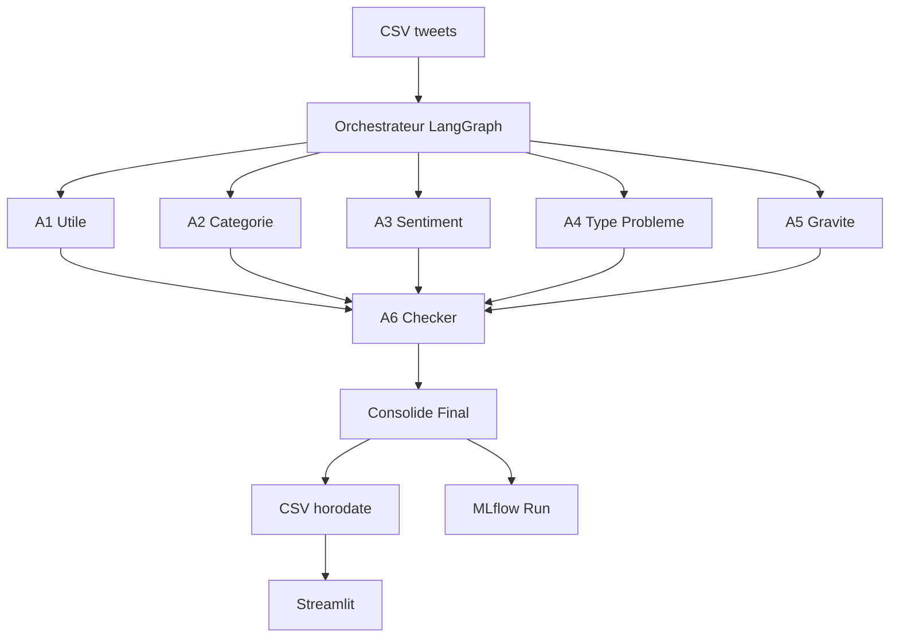
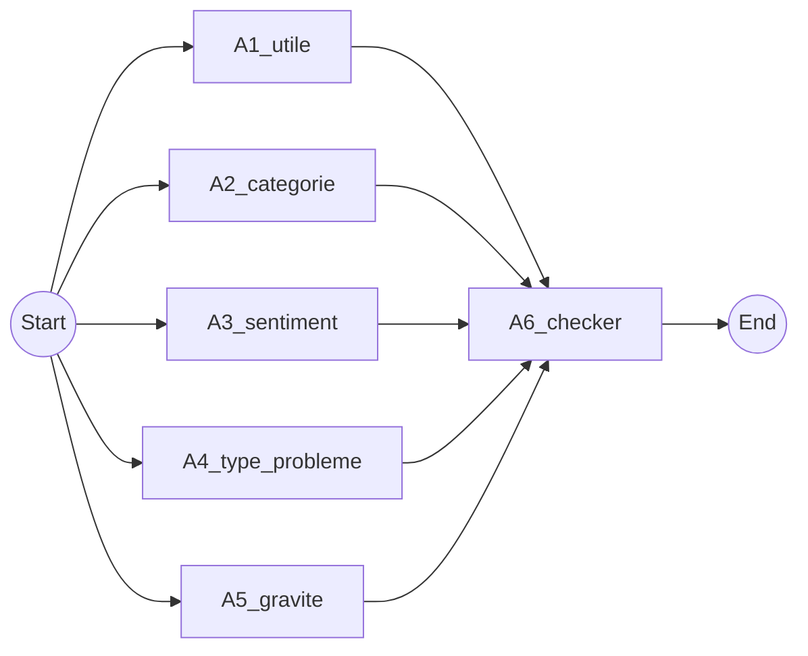
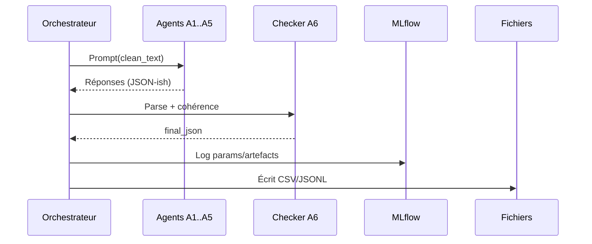
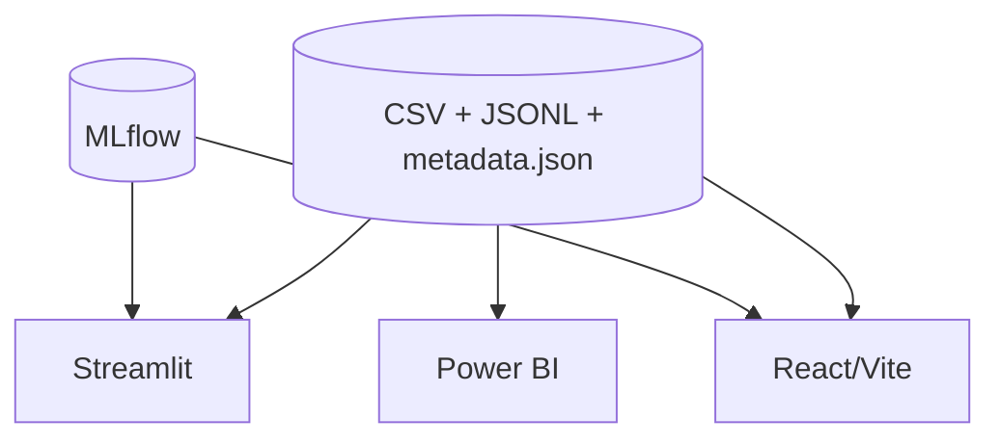

# FreeMind SAV Pipeline

Pipeline multi-agents (LangGraph + Ollama) pour analyser des tweets Free, suivre les exécutions dans MLflow et visualiser les résultats dans Streamlit/Frontend.

## Vue d'ensemble

- **Objectif**: capter les émotions, le type de problème et la gravité des messages liés aux offres Free.
- **Entrée**: CSV `data/cleaned/free_tweet_export-latest.csv` (ou autre export préparé).
- **Sorties**:
  - CSV horodatés dans `data/results/` (log + métadonnées JSON).
  - Traces/parametres/artefacts MLflow (`mlruns/`).
  - Tableau interactif via `apps/streamlit_app.py` et frontend React (`frontend/`).

## Flux LangGraph



### DAG des agents (détails)



## Roles des agents

| Agent | Role |
|-------|------|
| **A1_utile** | Determine si le tweet contient une idee pertinente sur les produits/experiences Free (tout signal client = true, hors pub/spam). |
| **A2_categorie** | Classe en `probleme`, `question` ou `retour_client`. |
| **A3_sentiment** | Detecte `colere`, `frustration`, `neutre`, `satisfaction`. |
| **A4_type_probleme** | Identifie le type (panne, facturation, abonnement, resiliation, information, autre). |
| **A5_gravite** | Score de -10 (tres positif) a +10 (critique). |
| **A6_checker** | Valide la coherence, consolide `Final_*`, sete `status` succes/erreur. |

Les prompts sources sont versionnes dans `prompts/freemind_prompts.json` (registre MLflow).

## Architecture d'ensemble

```mermaid
flowchart TD
    subgraph Runtime
        ORCH[orchestrator.py]
        GPU[GPU Watcher]
        LLM[Ollama (modèle)]
        MLF[(MLflow Tracking)]
        FILES[(data/results: CSV + JSONL + metadata)]
        JUDGE[judges/mlflow_judge.py]
    end
    INCSV[CSV d'entrée] --> ORCH
    ORCH --> LLM
    ORCH --> GPU
    ORCH --> FILES
    ORCH --> MLF
    JUDGE --> FILES
    JUDGE --> MLF
    UI[Streamlit] --> FILES
    FE[Frontend React] --> FILES
    BI[Power BI] --> FILES
    UI --> MLF
    FE --> MLF
    DVC[DVC] --- FILES
```

### Séquence MLflow (par tweet)



### Flux UI / Frontend



### Architecture Docker (optionnelle)

```mermaid
flowchart LR
    subgraph docker-compose
        orch[orchestrator (Python)] --> volResults[(./data/results)]
        orch --> volMlflow[(./mlruns)]
        orch --> ollama[ollama]
        mlflow[mlflow server] --> volMlflow
        streamlit[streamlit] --> volResults
        streamlit --> mlflow
    end
```

## Procedure d'execution

1. **Installer**: `python -m venv .venv && source .venv/bin/activate && pip install -r requirements.txt`
2. **Orchestrateur**: `python orchestrator.py`
   - `data/results/freemind_log_<timestamp>.csv`
   - `data/results/run_metadata_<timestamp>.json`
   - Artefacts MLflow (`mlruns/FreeMind_Orchestrator`)
3. **Streamlit**: `streamlit run apps/streamlit_app.py`
   - Choix dynamique des CSV
   - Apercu complet des colonnes agents + filtrage
4. **Experiment Control (nouveau)**:
   - Streamlit charge automatiquement la page `Experiment Control & Watchdog`
   - Lancez/stoppez l'orchestrateur, ajustez le nombre de tweets, appliquez un watchdog GPU
   - Edition des prompts A1-A6 (sauvegarde + enregistrement MLflow)
   - Boutons DVC (`dvc add/commit/push`) pour tracer `data/results`
   - Monitoring temps reel: `nvidia-smi`, graphiques Plotly (utilisation GPU, alertes), table live des sorties
   - Historique des runs (à partir des `run_metadata_*.json`)
4. **Evaluation/Prompts**: `python prompts/register_prompts.py` pour sync MLflow Prompt Registry, `python eval/run_prompt_eval.py` pour tester une variante.

## Traçage MLflow

- `mlflow.langchain.autolog()` + logs custom (JSON nettoye par tweet).
- Chaque run contient:
  - Params: modele, taille echantillon, version de prompt.
  - Metrics: latence moyenne, temps total.
  - Artefacts: CSV brut, JSON par tweet, Mermaid export (optionnel).
- Lancer l'UI: `mlflow ui --backend-store-uri file:./mlruns`.

## Visualisation & reporting

- **CLI**: chaque tweet imprime l'auteur et le texte complet pour inspection rapide.
- **Streamlit**: permet tri/filtre, detail d'un tweet, navigation entre executions.
- **Experiment Control**: interface temps réel pour lancer des experiences, éditer les prompts et surveiller le GPU/DVC.
- **CSV**: colonnes `A*_` et `Final_*` pre-parses sans JSON brut.

## Frontend React (Vite)

- Code: `frontend/`
- Démarrage rapide:
  - `cd frontend && npm install`
  - `npm run dev` (dev server)
  - `npm run build && npm run preview` (build + preview)
- Les pages consomment les CSV/JSON de `data/results/`. Adapter la base d'URL si nécessaire.

## Judge MLflow (cohérence post-run)

- Script: `python judges/mlflow_judge.py --log-csv data/results/freemind_log_latest.csv`
- Produit: `*_judge.csv` + `*_judge_summary.json` (pass/fail, top raisons)
- Loggue aussi les artefacts dans MLflow (`experiment: freemind_judges`)

## Docker (optionnel)

Un exemple de `docker-compose.yml` minimal (à adapter) :

```yaml
services:
  ollama:
    image: ollama/ollama:latest
    ports: ["11434:11434"]
    volumes: ["ollama:/root/.ollama"]
  orchestrator:
    image: python:3.11-slim
    working_dir: /app
    volumes:
      - ./:/app
      - ./data/results:/app/data/results
      - ./mlruns:/app/mlruns
    environment:
      - OLLAMA_HOST=http://ollama:11434
    command: bash -lc "pip install -r requirements.txt && python orchestrator.py"
    depends_on: [ollama]
  streamlit:
    image: python:3.11-slim
    working_dir: /app
    volumes:
      - ./:/app
      - ./data/results:/app/data/results
      - ./mlruns:/app/mlruns
    command: bash -lc "pip install -r requirements.txt && streamlit run apps/streamlit_app.py --server.port 8501 --server.address 0.0.0.0"
    ports: ["8501:8501"]
    depends_on: [orchestrator]
  mlflow:
    image: ghcr.io/mlflow/mlflow
    command: mlflow server --backend-store-uri file:/app/mlruns --host 0.0.0.0 --port 5000
    volumes: ["./mlruns:/app/mlruns"]
    ports: ["5000:5000"]
volumes:
  ollama: {}
```

## DVC (versionner les résultats)

```bash
dvc init
dvc add data/results
git add data/.gitignore data/results.dvc .dvc
git commit -m "Versionne les résultats du pipeline"
# Configurer un remote DVC puis:
dvc push
```

## Maintenance

- Ne pas effacer les anciens logs (`data/results` conserve l'historique).
- Les fichiers metadata servent à DVC/traçabilité.
- Adapter les prompts (A1-A6) en incrementant `version` dans `prompts/freemind_prompts.json` puis re-enregistrant dans MLflow.

